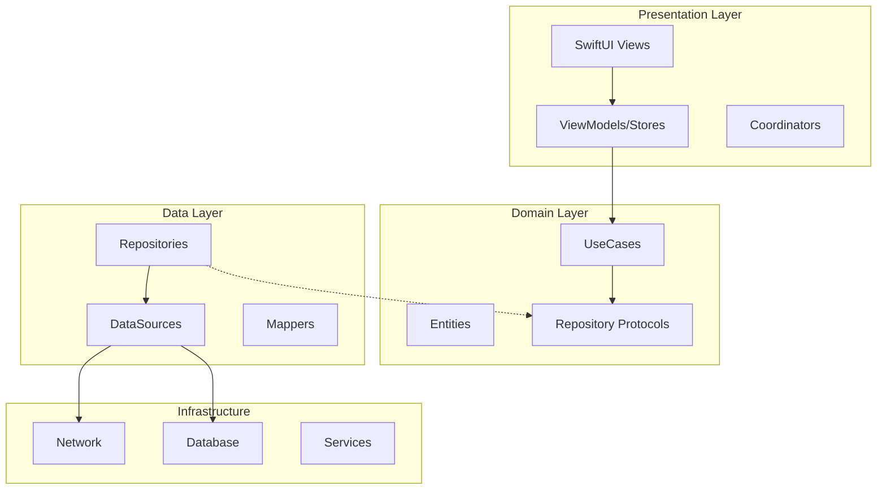

# Vroong Friends iOS 아키텍처 설계서

## 🎯 아키텍처 목표

1. **테스트 가능성**: 90% 이상 테스트 커버리지
2. **모듈화**: 기능별 독립적인 모듈 구조
3. **확장성**: 새로운 기능 추가가 용이한 구조
4. **유지보수성**: 클린 아키텍처 원칙 준수
5. **성능**: 네이티브 성능 최적화

## 🏗️ 전체 아키텍처

### Clean Architecture + MVVM + TCA



## 📁 프로젝트 구조

```
VroongFriends/
├── App/
│   ├── AppDelegate.swift
│   ├── SceneDelegate.swift
│   ├── VroongFriendsApp.swift
│   └── DI/
│       ├── AppContainer.swift
│       ├── AppEnvironment.swift
│       └── Injected.swift
│
├── Core/
│   ├── Extensions/
│   │   ├── UIKit+Extensions.swift
│   │   ├── SwiftUI+Extensions.swift
│   │   └── Foundation+Extensions.swift
│   ├── Utils/
│   │   ├── DateFormatter.swift
│   │   ├── NumberFormatter.swift
│   │   └── Logger.swift
│   ├── Base/
│   │   ├── BaseViewController.swift
│   │   └── BaseViewModel.swift
│   └── Constants/
│       ├── AppConstants.swift
│       └── APIConstants.swift
│
├── Domain/
│   ├── Entities/
│   │   ├── Order/
│   │   │   ├── Order.swift
│   │   │   ├── OrderStatus.swift
│   │   │   └── OrderDetail.swift
│   │   ├── User/
│   │   │   ├── User.swift
│   │   │   ├── Agent.swift
│   │   │   └── Profile.swift
│   │   ├── Location/
│   │   │   ├── Location.swift
│   │   │   └── Route.swift
│   │   └── Payment/
│   │       ├── MCash.swift
│   │       └── Transaction.swift
│   │
│   ├── UseCases/
│   │   ├── Auth/
│   │   │   ├── LoginUseCase.swift
│   │   │   ├── LogoutUseCase.swift
│   │   │   └── RefreshTokenUseCase.swift
│   │   ├── Order/
│   │   │   ├── GetOrdersUseCase.swift
│   │   │   ├── AcceptOrderUseCase.swift
│   │   │   └── CompleteOrderUseCase.swift
│   │   └── Location/
│   │       ├── StartTrackingUseCase.swift
│   │       └── UpdateLocationUseCase.swift
│   │
│   └── Repositories/
│       ├── AuthRepository.swift
│       ├── OrderRepository.swift
│       ├── LocationRepository.swift
│       └── PaymentRepository.swift
│
├── Data/
│   ├── Repositories/
│   │   ├── AuthRepositoryImpl.swift
│   │   ├── OrderRepositoryImpl.swift
│   │   └── LocationRepositoryImpl.swift
│   │
│   ├── DataSources/
│   │   ├── Remote/
│   │   │   ├── AuthRemoteDataSource.swift
│   │   │   ├── OrderRemoteDataSource.swift
│   │   │   └── API/
│   │   │       ├── APIClient.swift
│   │   │       ├── APIEndpoints.swift
│   │   │       └── APIError.swift
│   │   └── Local/
│   │       ├── AuthLocalDataSource.swift
│   │       ├── CoreDataStack.swift
│   │       └── UserDefaults+Storage.swift
│   │
│   ├── DTOs/
│   │   ├── Request/
│   │   │   ├── LoginRequest.swift
│   │   │   └── OrderRequest.swift
│   │   └── Response/
│   │       ├── LoginResponse.swift
│   │       └── OrderResponse.swift
│   │
│   └── Mappers/
│       ├── OrderMapper.swift
│       ├── UserMapper.swift
│       └── LocationMapper.swift
│
├── Presentation/
│   ├── Features/
│   │   ├── Auth/
│   │   │   ├── Login/
│   │   │   │   ├── LoginView.swift
│   │   │   │   ├── LoginViewModel.swift
│   │   │   │   └── LoginCoordinator.swift
│   │   │   └── Register/
│   │   │
│   │   ├── Order/
│   │   │   ├── OrderList/
│   │   │   │   ├── OrderListView.swift
│   │   │   │   ├── OrderStore.swift (TCA)
│   │   │   │   └── OrderListCoordinator.swift
│   │   │   └── OrderDetail/
│   │   │
│   │   ├── Map/
│   │   │   ├── MapView.swift
│   │   │   ├── MapStore.swift (TCA)
│   │   │   └── MapCoordinator.swift
│   │   │
│   │   ├── Chat/
│   │   │   ├── ChatView.swift
│   │   │   ├── ChatViewModel.swift
│   │   │   └── ChatCoordinator.swift
│   │   │
│   │   └── Payment/
│   │       ├── MCashView.swift
│   │       ├── MCashViewModel.swift
│   │       └── PaymentCoordinator.swift
│   │
│   ├── Common/
│   │   ├── Views/
│   │   │   ├── LoadingView.swift
│   │   │   ├── ErrorView.swift
│   │   │   └── EmptyView.swift
│   │   ├── Components/
│   │   │   ├── CustomButton.swift
│   │   │   ├── CustomTextField.swift
│   │   │   └── OrderCard.swift
│   │   └── Modifiers/
│   │       └── ViewModifiers.swift
│   │
│   └── Navigation/
│       ├── AppCoordinator.swift
│       ├── TabCoordinator.swift
│       └── NavigationStack.swift
│
└── Infrastructure/
    ├── Network/
    │   ├── NetworkService.swift
    │   ├── RequestInterceptor.swift
    │   ├── TokenManager.swift
    │   └── Reachability.swift
    │
    ├── Location/
    │   ├── LocationService.swift
    │   ├── BackgroundLocationManager.swift
    │   └── GeofenceManager.swift
    │
    ├── Push/
    │   ├── PushNotificationService.swift
    │   ├── FCMService.swift
    │   └── NotificationHandler.swift
    │
    ├── Map/
    │   ├── MapService.swift
    │   ├── NaverMapAdapter.swift
    │   └── KakaoMapAdapter.swift
    │
    ├── Chat/
    │   ├── SendbirdService.swift
    │   └── ChatManager.swift
    │
    ├── Security/
    │   ├── KeychainService.swift
    │   ├── BiometricService.swift
    │   └── EncryptionService.swift
    │
    └── Analytics/
        ├── AnalyticsService.swift
        ├── FirebaseAnalytics.swift
        └── EventTracker.swift
```

## 🔄 상태 관리 전략

### TCA (The Composable Architecture) - 복잡한 상태 관리

주문, 지도 등 복잡한 비즈니스 로직이 있는 기능에 적용

```swift
// OrderFeature.swift
struct OrderFeature: Reducer {
    struct State: Equatable {
        var orders: IdentifiedArrayOf<Order> = []
        var isLoading = false
        var selectedOrder: Order?
        var error: AppError?
    }
    
    enum Action: Equatable {
        case onAppear
        case loadOrders
        case ordersResponse(TaskResult<[Order]>)
        case selectOrder(Order.ID)
        case acceptOrder(Order.ID)
        case orderAccepted(Order.ID)
    }
    
    @Dependency(\.orderClient) var orderClient
    @Dependency(\.mainQueue) var mainQueue
    
    var body: some ReducerOf<Self> {
        Reduce { state, action in
            switch action {
            case .onAppear:
                return .send(.loadOrders)
                
            case .loadOrders:
                state.isLoading = true
                return .run { send in
                    await send(.ordersResponse(
                        TaskResult { try await orderClient.fetchOrders() }
                    ))
                }
                
            case let .ordersResponse(.success(orders)):
                state.orders = IdentifiedArray(uniqueElements: orders)
                state.isLoading = false
                return .none
                
            case let .ordersResponse(.failure(error)):
                state.error = error.toAppError()
                state.isLoading = false
                return .none
                
            case let .selectOrder(id):
                state.selectedOrder = state.orders[id: id]
                return .none
                
            case let .acceptOrder(id):
                return .run { send in
                    try await orderClient.acceptOrder(id)
                    await send(.orderAccepted(id))
                }
                
            case let .orderAccepted(id):
                state.orders[id: id]?.status = .inProgress
                return .none
            }
        }
    }
}
```

### MVVM + Combine - 간단한 상태 관리

채팅, 프로필 등 상대적으로 단순한 기능에 적용

```swift
// ChatViewModel.swift
class ChatViewModel: ObservableObject {
    @Published var messages: [Message] = []
    @Published var isLoading = false
    @Published var error: Error?
    
    private let chatService: ChatService
    private let chatRepository: ChatRepository
    private var cancellables = Set<AnyCancellable>()
    
    init(chatService: ChatService, chatRepository: ChatRepository) {
        self.chatService = chatService
        self.chatRepository = chatRepository
        
        observeMessages()
    }
    
    private func observeMessages() {
        chatService.messagePublisher
            .receive(on: DispatchQueue.main)
            .sink { [weak self] message in
                self?.messages.append(message)
            }
            .store(in: &cancellables)
    }
    
    func sendMessage(_ text: String) {
        Task {
            do {
                let message = try await chatRepository.send(text)
                await MainActor.run {
                    self.messages.append(message)
                }
            } catch {
                await MainActor.run {
                    self.error = error
                }
            }
        }
    }
}
```

## 💉 의존성 주입 (DI)

### Swinject 컨테이너 설정

```swift
// AppContainer.swift
class AppContainer {
    static let shared = Container()
    
    static func registerDependencies() {
        // MARK: - Network
        shared.register(APIClient.self) { _ in
            APIClient(baseURL: AppConstants.apiBaseURL)
        }.inObjectScope(.container)
        
        // MARK: - Services
        shared.register(LocationService.self) { _ in
            LocationServiceImpl()
        }.inObjectScope(.container)
        
        shared.register(SendbirdService.self) { _ in
            SendbirdServiceImpl(appId: AppConstants.sendbirdAppId)
        }.inObjectScope(.container)
        
        // MARK: - Data Sources
        shared.register(AuthRemoteDataSource.self) { resolver in
            AuthRemoteDataSourceImpl(
                apiClient: resolver.resolve(APIClient.self)!
            )
        }
        
        shared.register(AuthLocalDataSource.self) { _ in
            AuthLocalDataSourceImpl()
        }
        
        // MARK: - Repositories
        shared.register(AuthRepository.self) { resolver in
            AuthRepositoryImpl(
                remoteDataSource: resolver.resolve(AuthRemoteDataSource.self)!,
                localDataSource: resolver.resolve(AuthLocalDataSource.self)!
            )
        }
        
        // MARK: - Use Cases
        shared.register(LoginUseCase.self) { resolver in
            LoginUseCase(
                repository: resolver.resolve(AuthRepository.self)!
            )
        }
        
        // MARK: - ViewModels
        shared.register(LoginViewModel.self) { resolver in
            LoginViewModel(
                loginUseCase: resolver.resolve(LoginUseCase.self)!,
                tokenManager: resolver.resolve(TokenManager.self)!
            )
        }
    }
}
```

## 🔐 보안 아키텍처

### Keychain 통합

```swift
// KeychainService.swift
class KeychainService {
    enum Key: String {
        case accessToken
        case refreshToken
        case userCredentials
    }
    
    func save(_ data: Data, for key: Key) throws {
        let query: [String: Any] = [
            kSecClass as String: kSecClassGenericPassword,
            kSecAttrAccount as String: key.rawValue,
            kSecValueData as String: data
        ]
        
        SecItemDelete(query as CFDictionary)
        
        let status = SecItemAdd(query as CFDictionary, nil)
        guard status == errSecSuccess else {
            throw KeychainError.unableToSave
        }
    }
    
    func load(for key: Key) throws -> Data {
        let query: [String: Any] = [
            kSecClass as String: kSecClassGenericPassword,
            kSecAttrAccount as String: key.rawValue,
            kSecReturnData as String: true
        ]
        
        var result: AnyObject?
        let status = SecItemCopyMatching(query as CFDictionary, &result)
        
        guard status == errSecSuccess,
              let data = result as? Data else {
            throw KeychainError.itemNotFound
        }
        
        return data
    }
}
```

### RSA 암호화

```swift
// EncryptionService.swift
class EncryptionService {
    func encryptRSA(_ data: Data, publicKey: SecKey) throws -> Data {
        var error: Unmanaged<CFError>?
        guard let encryptedData = SecKeyCreateEncryptedData(
            publicKey,
            .rsaEncryptionPKCS1,
            data as CFData,
            &error
        ) as Data? else {
            throw EncryptionError.encryptionFailed
        }
        return encryptedData
    }
}
```

## 🗺️ 네비게이션 아키텍처

### Coordinator 패턴

```swift
// AppCoordinator.swift
class AppCoordinator: Coordinator {
    var navigationController: UINavigationController
    var childCoordinators: [Coordinator] = []
    
    init(navigationController: UINavigationController) {
        self.navigationController = navigationController
    }
    
    func start() {
        if TokenManager.shared.isLoggedIn {
            showMain()
        } else {
            showLogin()
        }
    }
    
    private func showLogin() {
        let loginCoordinator = LoginCoordinator(
            navigationController: navigationController
        )
        loginCoordinator.delegate = self
        childCoordinators.append(loginCoordinator)
        loginCoordinator.start()
    }
    
    private func showMain() {
        let tabCoordinator = TabCoordinator(
            navigationController: navigationController
        )
        childCoordinators.append(tabCoordinator)
        tabCoordinator.start()
    }
}
```

## 🧪 테스트 전략

### 유닛 테스트 구조

```swift
// LoginUseCaseTests.swift
class LoginUseCaseTests: XCTestCase {
    var sut: LoginUseCase!
    var mockRepository: MockAuthRepository!
    
    override func setUp() {
        super.setUp()
        mockRepository = MockAuthRepository()
        sut = LoginUseCase(repository: mockRepository)
    }
    
    func testLoginSuccess() async throws {
        // Given
        let expectedUser = User.mock
        mockRepository.loginResult = .success(expectedUser)
        
        // When
        let result = try await sut.execute(
            username: "test",
            password: "password"
        )
        
        // Then
        XCTAssertEqual(result, expectedUser)
        XCTAssertTrue(mockRepository.loginCalled)
    }
}
```

## 📈 성능 최적화

### 이미지 캐싱

```swift
// ImageCache.swift
actor ImageCache {
    private var cache = NSCache<NSString, UIImage>()
    
    func image(for url: URL) async -> UIImage? {
        let key = url.absoluteString as NSString
        
        if let cached = cache.object(forKey: key) {
            return cached
        }
        
        guard let image = await loadImage(from: url) else {
            return nil
        }
        
        cache.setObject(image, forKey: key)
        return image
    }
}
```

### 백그라운드 위치 최적화

```swift
// BackgroundLocationManager.swift
class BackgroundLocationManager {
    func startBackgroundTracking() {
        locationManager.allowsBackgroundLocationUpdates = true
        locationManager.pausesLocationUpdatesAutomatically = false
        locationManager.desiredAccuracy = kCLLocationAccuracyBestForNavigation
        locationManager.distanceFilter = 10 // 10미터마다 업데이트
        locationManager.startUpdatingLocation()
    }
}
```

## 🎯 기술 결정 사항

| 영역 | 기술 선택 | 이유 |
|------|----------|------|
| **UI Framework** | SwiftUI + UIKit | 모던 UI + 레거시 지원 |
| **아키텍처** | Clean + MVVM + TCA | 복잡도에 따른 유연한 선택 |
| **상태관리** | TCA + Combine | 단방향 데이터 플로우 |
| **네트워킹** | Moya + Alamofire | 타입 세이프 + 강력한 기능 |
| **DI** | Swinject | 성숙도 + 커뮤니티 |
| **네비게이션** | Coordinator | 모듈화 + 테스트 용이 |
| **로컬 저장소** | CoreData + UserDefaults | Apple 표준 |
| **이미지 캐싱** | SDWebImage | 검증된 라이브러리 |
| **지도** | Native SDK | 공식 SDK 활용 |
| **분석** | Firebase | 기존 인프라 활용 |